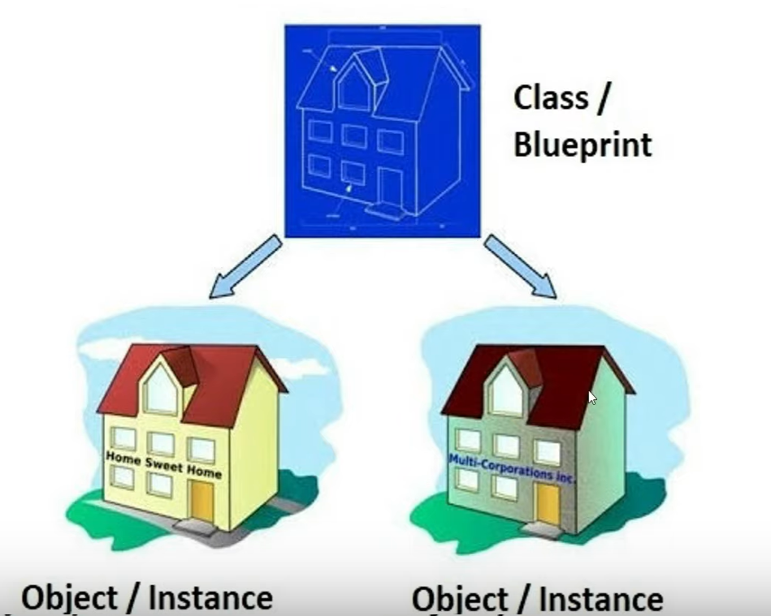
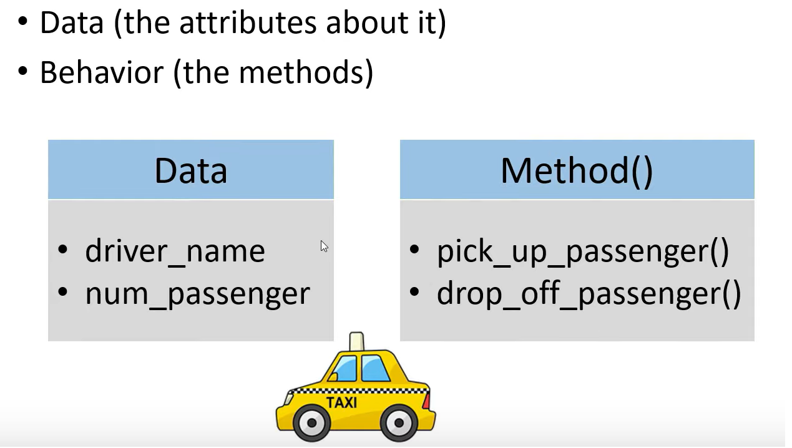
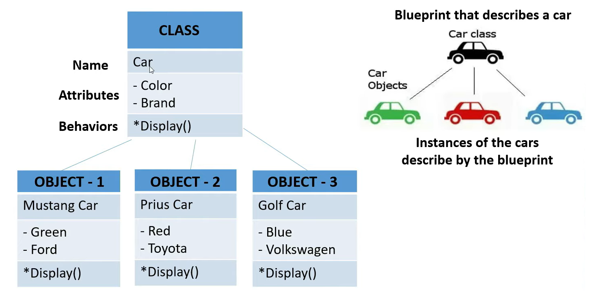

### what is class in object oriented programming ?
> A class is athe blue print for the objects, created from the class.
> Each class contains some data definitions (called fields), togeter with methods to manipulate that data.
> When the object is instantiated from the class, an instance variable is created for each field in the class.

### What is object of a class ?
> object are the basic run time entities in an object oriented system, an instance of a class, objects are the variables of the type class.

### Show a relation between Object and Class.


### Discribe the components of a class.


### What is Method?
> A python method is like a python function. it must be called on an object which need to be put inside a class, can return statement.

### Show an Example of class and object.

### What is Constructor?
- A special kind of method we use to initialize instance members of that class.
- It is used for initializing the instance members when we create the object of a class.
- If you create4 four objects, the class constructor will call four times.
- Every class must have a constructor, even if it simply relies on the default constructor.
- constructors can be two types.
  - Non-parameterized constructor (Default Constructor)
  - Parameterized Constructor


```python
#Example of a default constructor
class Employee:
    def __init__(self):
        print("Employee object Created")

emp1 = Employee()
emp2 = Employee()
``` 
### Output: 
> Employee object Created <br>
> Employee object Created

```python
class Employee:
    def__init__(self,name):
        # instance variable
        self.name = name
        print(self.name, "created!")

#instance 1
emp1 = Employee("John")
#instance 2
emp2 = Employee("David")
```
### Output: 
> John created <br>
> David created

### What is Constructor?
- A special kind of method we use to initialize instance members of that class.
- It is used for initializing the instance members when we create the object of a class.
- If you create4 four objects, the class constructor will call four times.
- Every class must have a constructor, even if it simply relies on the default constructor.
- constructors can be two types.
  - Non-parameterized constructor (Default Constructor)
  - Parameterized Constructor


```python
#Example of a default constructor
class Employee:
    def __init__(self):
        print("Employee object Created")

emp1 = Employee()
emp2 = Employee()
``` 
### Output: 
> Employee object Created <br>
> Employee object Created

```python
class Employee:
    def__init__(self,name):
        # instance variable
        self.name = name
        print(self.name, "created!")

#instance 1
emp1 = Employee("John")
#instance 2
emp2 = Employee("David")
```
### Output: 
> John created <br>
> David created

### What is Instance Method ? 
- Instance Method are methods which require an object of its class to be created before it can be called.
- Instance methods need a class instance and can access the instance through __self__.
- Instance method takes more than one paramenter,__self__, which points to an instance of a class.
- The __self__ parameter, instance methods can freely access attributes and other methods on the same object.

```python
class Employee: #class / design / blue print
    #parametrized constructor
    def __init__(self,name,no):
        self.no = no #instance variable
        self.name = name # instance variable
        contact = "+880-xxxxxxx" # Local variable

    # instance method
    def display(self):
        print(self.name,self.no)
   
emp1 = Employee("John",11) #instance 1
emp2 = Employee("David",12) #instance 2 object / Instance
emp1.display()
emp2.display()
```
### What is the use of __dict__ and dir()? 
> if argument is given, it returns a list of valid attributes for that object.
```python
s1 = Student("Bob",12,"01322352864")
s1.display()
print(dir(s1))
```
### output of dir() method:
```python 
['__class__', '__delattr__', '__dict__', '__dir__', '__doc__', '__eq__', '__format__', '__ge__', '__getattribute__', '__gt__', '__hash__', '__init__', '__init_subclass__', '__le__', '__lt__', '__module__', '__ne__', '__new__', '__reduce__', '__reduce_ex__', '__repr__', '__setattr__', '__sizeof__', '__str__', '__subclasshook__', '__weakref__', 'contact', 'display', 'student_id', 'student_name']
```


> The __dict__ in Python represents a dictionary or any mapping object that is used to store the attributes of the object.
```python
s1 = Student("Bob",12,"01322352864")
s1.display()
print(s1.__dict__)
```

### output of __dict__ method:

```python
{'student_name': 'Bob', 'student_id': 12, 'contact': '01322352864'}