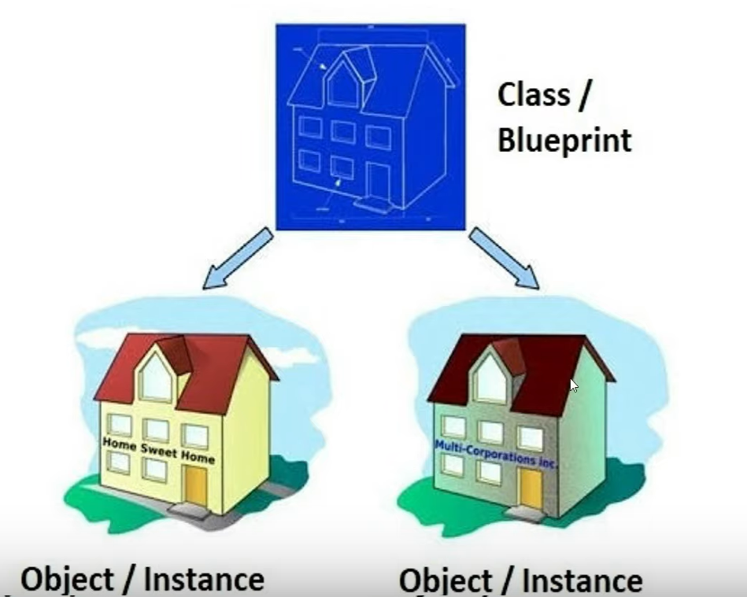

### what is class in object oriented programming ?
> A class is athe blue print for the objects, created from the class.
> Each class contains some data definitions (called fields), togeter with methods to manipulate that data.
> When the object is instantiated from the class, an instance variable is created for each field in the class.

### What is object of a class ?
> object are the basic run time entities in an object oriented system, an instance of a class, objects are the variables of the type class.

### Object and Class Relationship.

