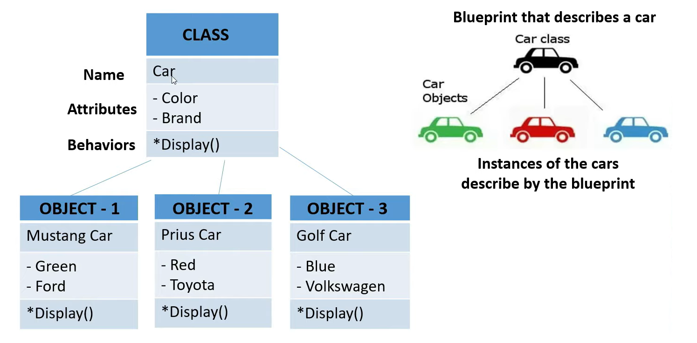

### what is class in object oriented programming ?
> A class is athe blue print for the objects, created from the class.
Each class contains some data definitions (called fields), togeter with methods to manipulate that data.  
When the object is instantiated from the class, an instance variable is created for each field in the class.  

### What is object of a class ?
> object are the basic run time entities in an object oriented system, an instance of a class, 
objects are the variables of the type class.

### Show a relation between Object and Class.


### Discribe the components of a class.


### What is Method?
> A python method is like a python function. it must be called on an object which need to be put inside a class, can return statement.

### Show an Example of class and object.


### What is Constructor?
- A special kind of method we use to initialize instance members of that class.
- It is used for initializing the instance members when we create the object of a class.
- If you create4 four objects, the class constructor will call four times.
- Every class must have a constructor, even if it simply relies on the default constructor.
- constructors can be two types.
  - Non-parameterized constructor (Default Constructor)
  - Parameterized Constructor


```python
#Example of a default constructor
class Employee:
    def __init__(self):
        print("Employee object Created")

emp1 = Employee()
emp2 = Employee()
``` 
### Output: 
> Employee object Created <br>
> Employee object Created

```python
class Employee:
    def__init__(self,name):
        # instance variable
        self.name = name
        print(self.name, "created!")

#instance 1
emp1 = Employee("John")
#instance 2
emp2 = Employee("David")
```
### Output: 
> John created <br>
> David created