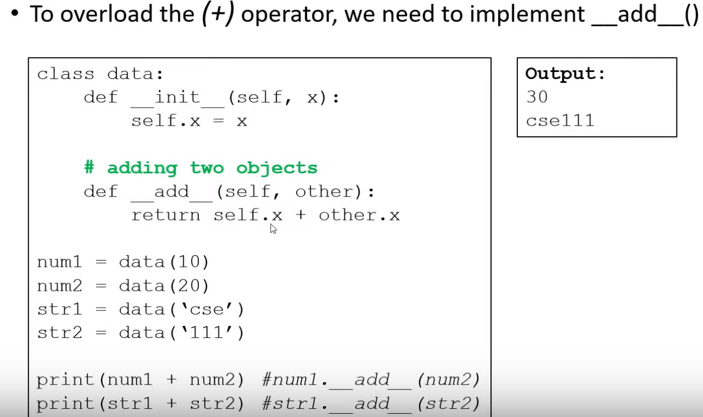
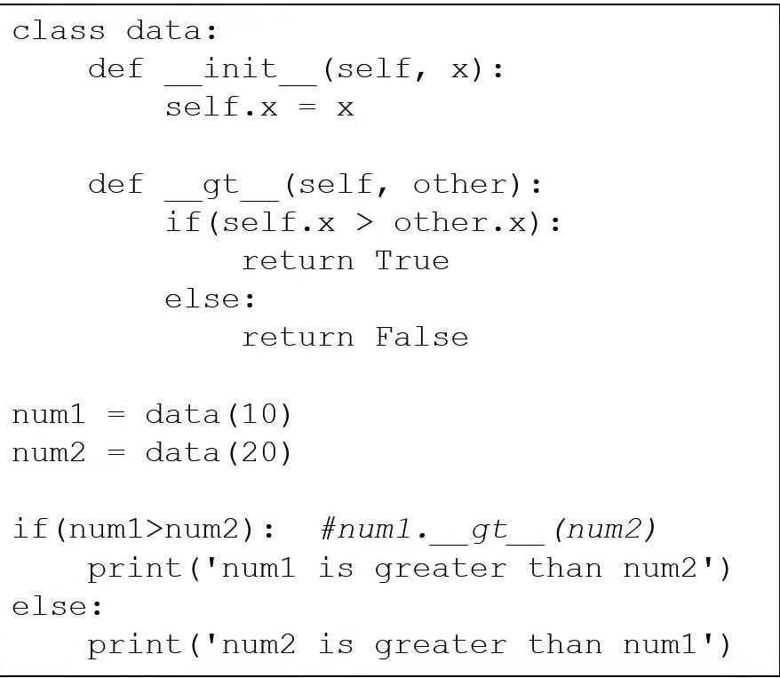

### What is operator overloading?
> Operator overloading in Python refers to the ability to redefine how operators work for user-defined classes. This means that you can specify how operators like addition (+), subtraction (-), multiplication (*), etc., behave when applied to objects of your custom classes. We must use special function to implement the necessary requirements. 

1. __add__(self, other): Defines behavior for the addition operator +.
2. __sub__(self, other): Defines behavior for the subtraction operator -.
3. __mul__(self, other): Defines behavior for the multiplication operator *.
4. __truediv__(self, other): Defines behavior for the division operator /.
5. __floordiv__(self, other): Defines behavior for the floor division operator //.
6. __mod__(self, other): Defines behavior for the modulo operator %.
7. __pow__(self, other[, modulo]): Defines behavior for the exponentiation operator **.
8. __eq__(self, other): Defines behavior for the equality operator ==.
9. __ne__(self, other): Defines behavior for the inequality operator !=.
10. __lt__(self, other): Defines behavior for the less-than operator <.
11. __le__(self, other): Defines behavior for the less-than-or-equal-to operator <=.
12. __gt__(self, other): Defines behavior for the greater-than operator >.
13. __ge__(self, other): Defines behavior for the greater-than-or-equal-to operator >=.
14. __str__(self): Defines behavior for when str() is called on an instance of the class.
15. __repr__(self): Defines behavior for when repr() is called on an instance of the class.
16. __len__(self): Defines behavior for when len() is called on an instance of the class.
17. __getitem__(self, key): Defines behavior for when an item is retrieved using the index operator [].
18. __setitem__(self, key, value): Defines behavior for when an item is assigned using the index operator [].
19. __delitem__(self, key): Defines behavior for when an item is deleted using the index operator [].
20. __iter__(self): Returns an iterator object.
21. __next__(self): Retrieves the next item from the iterator.
22. __contains__(self, item): Defines behavior for membership test operators like in and not in.


<br>


```python
class data: 
    def __init__(self, x):
        self.x = x 
    def __add__(self,other):
        return self.x + other.x 
    def __sub__(self, other):
        return self.x - other.x 
    
num1 = data(12)
num2 = data(34)
print(num1+num2)
print(num1-num2)
```

<b>Real Life Example </b>

```python
class Home:
    def __init__(self,window,door):
        self.window = window
        self.door = door 
    
    def view(self):
        return f"total door = {self.door} and total window = {self.window}"
    def __add__(self,other):
        total_windows = self.window + other.window 
        total_doors = self.door + other.door   
        return f"total door {total_doors} and total window {total_windows}"

h1 = Home(12,22)
h2 = Home(33,444)
print(h1.view())
print(h2.view())
print(h1+h2)

```